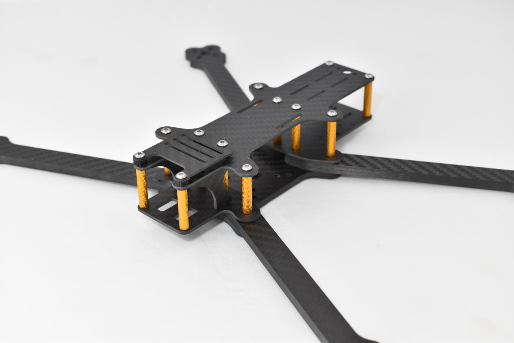
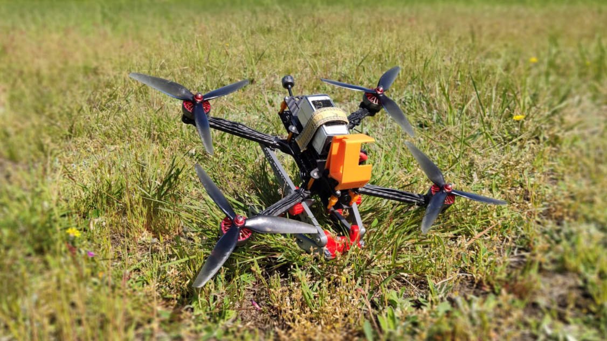

# Pirx Frames
The official repository of Pirx quadcopter frames

# License

<a property="dct:title" rel="cc:attributionURL" href="https://github.com/DzikuVx/pirx-frames">Pirx Frames</a> by Paweł Spychalski is licensed under <a href="http://creativecommons.org/licenses/by-nc/4.0/?ref=chooser-v1" target="_blank" rel="license noopener noreferrer" style="display:inline-block;">CC BY-NC 4.0</a>

All the Pirx frames are available to you for free under the Creative Commons BY-NC-4.0 license. This means that:
1. You can download all the designs and order frame milled wherever you want and use them however you like
1. You can modify the files and publish them as long as you give attribution and release under the same license
1. You **CAN NOT** mill and sell Pirx frames to others. Commercial usage of the deisign files is prohibited

Pirx Frames are available to you free of any charge with tons of 3D printed accessories, designs and tunes. If you like my work, please consider sending me a small tip for coffee, beer or something! Thanks a lot!

## Pirx HD.7

Can be ordered from [Armattan Production](https://armattanproductions.com/pages/kit_detail/2927)

Pirx HD.7 is a 7-inch freestyle and cruiser frame. Its main configuration is designed to give you the taste of how freestyle on 7 inches feels like. And trust me, it's different than 5-inch freestyle. With a couple of 3D printed add-ons, it can be easily converted to a cruiser / long-range machine.

Features:
* 20x20 and 30x30 stacks
* Fits analog and HD FPV systems (both DJI Air Unit and Caddx Vista)
* Designed for battery-on-top, can carry battery on the bottom

### Parts

#### CNC

* `Pirx HD 7-inch Arm 6mm` - 4pcs - 6mm carbon
* `Pirx HD Bottom Plate 4mm` - 1pcs - 4mm carbon
* `Pirx HD Front Plate 2mm` - 1pcs - 2mm carbon
* `Pirx HD Rear Plate 2mm` - 1pcs - 2mm carbon
* `Pirx HD Side Plate 2mm` - 2pcs - 2mm carbon
* `Pirx HD Top Bumper 1_5mm` - 1pcs - 1.5 or 2mm carbon
* `Pirx HD Top Plate 2mm` - 1pcs - 2mm carbon

#### 3D Printed parts

* (required) camera bracket - 2pcs - print with TPU 
* (required) bumber spacers - 4pcs - print with PLA/PET/ABS
* (optional) XT60 holder - Left or Right - print with TPU
* (optional) Caddx Vista Antenna Mount - print with TPU
* (optional) GoPro Hero 5/6/7 30 deg sleeve

#### Other

* [25mm M3 aluminium standoffs](https://bit.ly/3v1vFDE) - 12pcs
* 6mm M3 screws - 12pcs
* 16mm M3 screws - 8pcs
* 12mm M3 screws - 4pcs

### Reference build

* Motors - [EMAX ECO II 2807](https://bit.ly/34RYWGk)
* ESC - [Foxeer Reaper Mini 60A](https://bit.ly/2QaBWy2)
* Flight controller - [ZEEZ F7 2020](https://bit.ly/3uD8srp)
* Propllers - [DALprop FOLD F7 v2](https://bit.ly/3ikpE2b) 